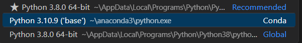

# Dashboard Bike Sharing✨

## Setup environment
```
Install python ver 3.10, and environment

pip version 23.2.1

Method 1 (install manual 1by1)
pip install streamlit
pip install numpy pandas scipy matplotlib seaborn 

Method 2 
pip install -r requirements.txt
```

## Run streamlit app
```
streamlit run dashboard/dashboard.py
```

## Link: steamlit app

Here's the link: https://dashboard-bikesharing-da.streamlit.app/


## User Interface System Bike Sharing


## View Dashboard Directly
On the dashboard, you can see data related to the Bike Sharing Dataset. Data is displayed with a filter feature to see total users, temp, atemp, hum. Apart from that, graphs related to the bike sharing dataset are presented.


## Etc:
Source img: https://www.freepik.com/free-vector/location-review-concept-illustration_22635609.htm#query=bike%20sharing&position=2&from_view=search&track=ais
